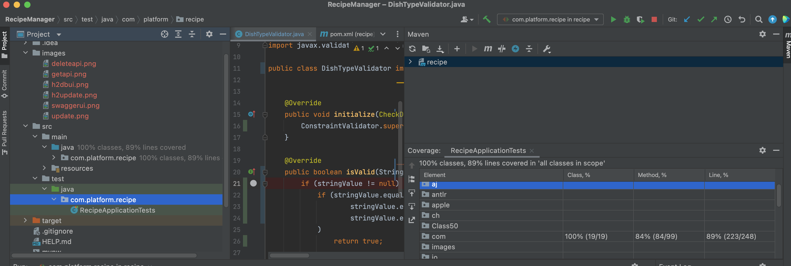

## Recipe Manager

Recipe Manager platform includes APIs for creating, listing, updating and deleting recipes within the specified rules. The recipes created are stored in the H2 in memory database. Among the recipes created, dynamic searches can be made according to portion size, recipe content,  dish type. Hibernate is used as JPA implementation. Validations are controlled with javax validations and annotations. The application can also be used on container platforms by following the instructions below. Create api works as post and if successful, 201 http code is returned. Update api works as put and if it is successful, 200 http code is returned. Delete api works as delete and if it is successful, 200 http code is returned. The listing api works as get and if it is successful, 200 http code is returned. Errors are caught at the controller level with controller advice. For the listing api, Criteria Builder is used for dynamic querying.


## Used Technical Stack

```
------Back End ------
- Java 11
- Springboot 2.5.2
- Maven 3.6.3
- Lombok
- Swagger 2 API documentation
- Junit for TDD
- CriteriaBuilder
- H2 Database engine
- Rest Service Standarts
- Docker for containerization
- ModelMapper for object mapping
- Javax Validation for request validation
- Logback Project

------Front End ------
- React 16
- React-router-dom 5.1.2
- Axios 0.19.2
- Bootstrap 4.4.1

```

## Tasks

    - Setup project properly from spring initialzr.
	- Make a design for business rules and APIs.
	- Start implementation of api logics with tests and TDD.
	   - platforms & technical stacks to be used were determined
       - design & development of cross-cutting features
       - design & development of business rules
	   - the design of the APIs has been completed
    - Completed development of API implementations
     
# Getting Started

## Installation
1. Clone the repo
    >https://github.com/RafetC/RecipeManager.git

3. Import project in IntellJ IDEA

4. Choose the Spring Boot Application file (search for @SpringBootApplication)

5. Right Click on the file and Run as Java Application


## Build and Run from source codes
    mvn clean install
    java -jar target/recipe-0.0.1-SNAPSHOT.jar


## Running with docker

`docker-compose up --build`


## Usage
  There are 4 APIs in Recipe Platform 
 
### Test with Swagger
 >http://localhost:8080/swagger-ui.html#/recipe-controller

  

### JUnit Api Testing   
Tests have been written and executed to cover almost all classes and methods.
>http://localhost:8080/swagger-ui.html#/recipe-controller



  
### Acces H2 Database Engine console
 >http://localhost:8080/h2console/
  
   

### APIs Usage
* `/addRecipe`
  
  The **addRecipe** API create a food recipe. After the Add API checks certain rules, it adds the recipe to the database.
 
  _Sample POST Request:_
```
 {
  "cookingInstructions": "Allow 30 to 45 minutes for oven and meat 
  temperature to rise and continue to cook at 275 to 300 degrees until
   done. ( usually 4-7 hours depending on size of meat ) ",
  
  "dishType": "MEAT",
  
   "ingredients": [
    "meat","salt","water"
  ],
  "portionSize": 4
}
```
_Sample Response:_
```
{
  "id": 1,
  "dishType": "MEAT",
  "portionSize": 4,
  "ingredients": [
    "meat",
    "salt",
    "water"
  ],
  "createDate": "08.03.2022 20:14",
  "cookingInstructions": "Allow 30 to 45 minutes for oven and meat 
   temperature to rise and continue to cook at 275 to 300 degrees until 
   done. ( usually 4-7 hours depending on size of meat ) "
}
```
 
 

* `/deleteRecipe`
  
  
   The **deleteRecipe** API accepts DELETE requests. It deletes related recipe with ID.

_Sample DELETE Request:_
```
curl -X DELETE "http://localhost:8080/deleteRecipe?recipeId=4" -H "accept: */*"
```


* `/recipes`
  The **RECIPES** API accepts GET requests. With dynamic queries, related recipes can be listed in the desired filters. This filters generated by CriteriaBuilder.

_Sample GET Requests:_
```
http://localhost:8080/recipes  -- Get All Recipes
http://localhost:8080/recipes?id=1 --Get Recipes By ID
http://localhost:8080/recipes?maxPortionSize=5&minPortionSize=2 --Recipes filter by portion size
http://localhost:8080/recipes?cookInstruction=meat&maxPortionSize=5 -- filter with portion size and  get recipes that contain meat 
```


* `/updateRecipe`
 The **updateRecipe** API accepst PUT requests. Update API allows to update the information of the related recipe. Validations  in the Create API also work in Update API. Update date is stored in database. 

_Sample PUT Request:_
```
{
  "id": 1,
  "dishType": "Meat",
  "portionSize": 4,
  "ingredients": [
    "string"
  ],
   
  "cookingInstructions": "Update"
}
```


### API Payload logging

I used to logback project for logging request/response payload and 
I implement file logging service . Logging infrastructure system is extensible
system. Easily develop for Kafka integration or another LogMode. Logging system is running with aspect . 
I used the @Around annotation for handle before and after method joinpoints.

Example of a log for single Request/Respone

```
<ApiPayloadLog>
<ApiUrl>/updateRecipe</ApiUrl>
<MethodName>updateRecipe</MethodName>
<MethodType>PUT</MethodType>
<ThreadID>1</ThreadID>
<StartTime>10-03-2022 at 11:31:50 CET</StartTime>
<Parameters>[ {
  "id" : 3,
  "dishType" : "MEAT",
  "portionSize" : 50,
  "ingredients" : [ "2 Eggs", "Olive oil", "Butter", "Chicken" ],
  "cookingInstructions" : "Updated"
} ]</Parameters>
<Output>{
  "headers" : { },
  "body" : true,
  "statusCodeValue" : 200,
  "statusCode" : "OK"
}</Output>
<EndTime>10-03-2022 at 11:31:50 CET</EndTime>
</ApiPayloadLog>
```

## Recipe Platform Client
The client application was developed with React 16 and the frontend components were developed using 
the APIs developed in the backend.Axios is used in HTTP calls.

### Installation
```
npm start
```


### Usage 
##### Add Recipe
API validation errors encountered while adding a recipe are shown to the user on the screen.


We can create a new recipe by filling in the relevant fields.


#### Recipe List
You can see all recipe list from the listing screen.You can filter recipes 
with cooking instructions


#### Recipe Detail
When you click a recipe you can see detail of Recipe


#### Receipt Update
You can update recipe detail via update component


#### Recipe Delete

You can delete recipe by recipe id with delete component


### Recipe Update Validation

Recipe validations are executing in update component


